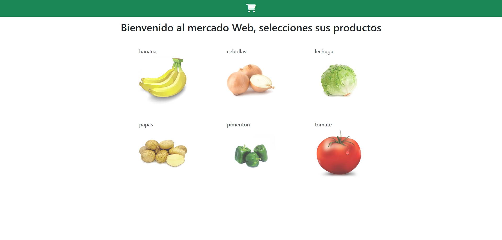
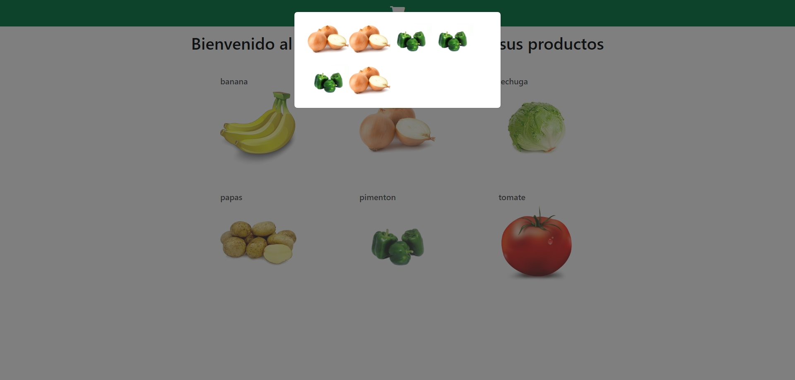

# Desafío evaluado - Mercado web

## Descripción

El Mini Market “Come Sano, Come Fresco Spa” busca desarrollar una aplicación web para ofrecer y vender sus productos alimenticios en línea. La aplicación deberá permitir actualizaciones frecuentes en la presentación, contenido y funcionalidades mediante el uso de parciales y motores de plantillas.

Para este desafío, deberás construir un servidor con Express que utilice Handlebars como motor de plantillas. El objetivo es desarrollar componentes reutilizables y renderizar variables e iteradores en las vistas del sitio web.

En el archivo Apoyo Desafío - Mercado web encontrarás imágenes correspondientes para referencia. Puedes crear tu propia interfaz siempre y cuando cumpla con los requisitos funcionales y la temática planteada.

Las siguientes imágenes representan las interacciones esperadas del sitio web al finalizar el desafío:

- **Imagen 1**: Dashboard

- **Imagen 2**: Ventana modal con productos seleccionados

Para el control de datos, puedes utilizar diversas herramientas como LocalStorage, un arreglo en el servidor, un archivo JSON gestionado con FileSystem, o PostgreSQL. Si optas por PostgreSQL, asegúrate de incluir el archivo de base de datos o las sentencias SQL necesarias al final del archivo del servidor.

## Requerimientos

1. **Crear una ruta raíz** que al ser consultada renderice una vista con un parcial “Dashboard” enviándole un arreglo con los nombres de los productos. Se recomienda que estos nombres coincidan con las imágenes de cada producto.

2. **Incluir en la vista un parcial** que contenga el menú del sitio web y sea renderizado antes del Dashboard.

3. **Crear un parcial “producto”** que contenga el template para la presentación de cada producto en el Dashboard y reciba como parámetro el nombre del producto.

4. **Crear un parcial para la sección principal** en donde se renderice un helper con el mensaje de bienvenida y se realice una iteración para renderizar un parcial “producto” pasándole como argumento el nombre de cada producto.

5. **Consumir los códigos fuentes de Bootstrap y jQuery** a través de rutas o middlewares creados en el servidor. Estas dependencias deben ser instaladas con NPM.

## Estructura del Proyecto

- **`server.js`**: Archivo principal que configura y arranca el servidor Express. Configura rutas, middlewares, y Handlebars como motor de plantillas.
- **`views/`**: Carpeta que contiene los archivos de vistas de Handlebars.
  - **`partials/`**: Carpeta para los parciales de Handlebars (e.g., `dashboard.hbs`, `menu.hbs`, `producto.hbs`, etc.).
- **`public/`**: Carpeta pública para archivos estáticos.
  - **`css/`**: Archivos de estilo CSS.
  - **`js/`**: Archivos JavaScript, incluidos los scripts para Bootstrap y jQuery.
  - **`img/`**: Imágenes utilizadas en el sitio web.

## Tecnologías Utilizadas

- **Node.js**: Entorno de ejecución para JavaScript en el servidor.
- **Express**: Framework para Node.js que facilita la creación y manejo del servidor y las rutas.
- **Handlebars**: Motor de plantillas para renderizar HTML en el servidor.
- **Bootstrap**: Framework de CSS para el diseño responsivo.
- **jQuery**: Biblioteca de JavaScript para simplificar la manipulación del DOM y eventos.
- **npm**: Para la gestión de dependencias.

## Autor

Este proyecto fue desarrollado por **Valeria Torrealba**.